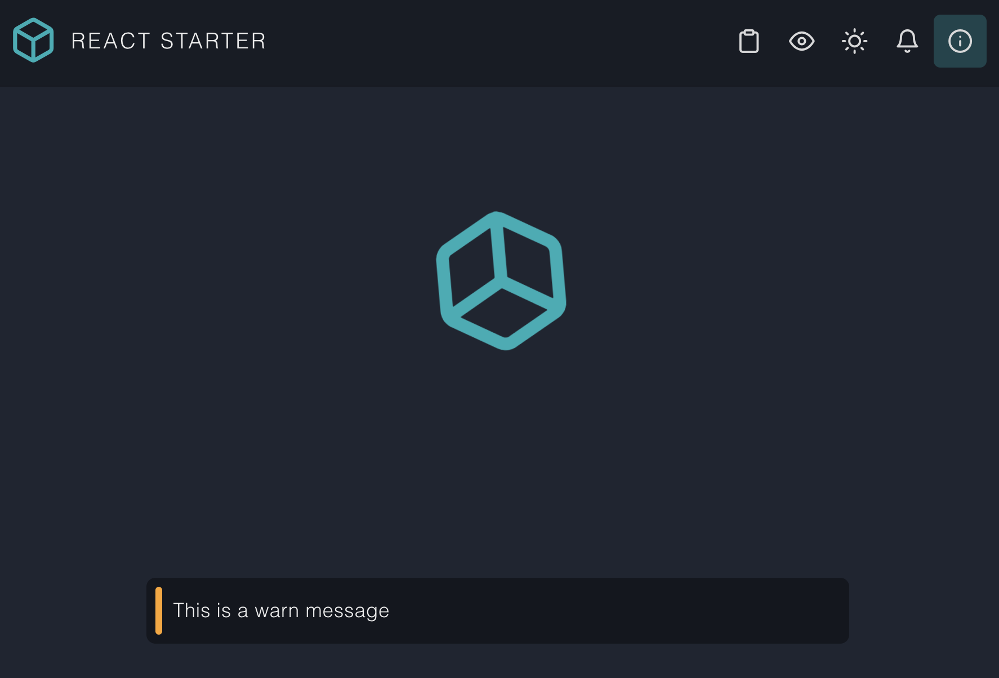
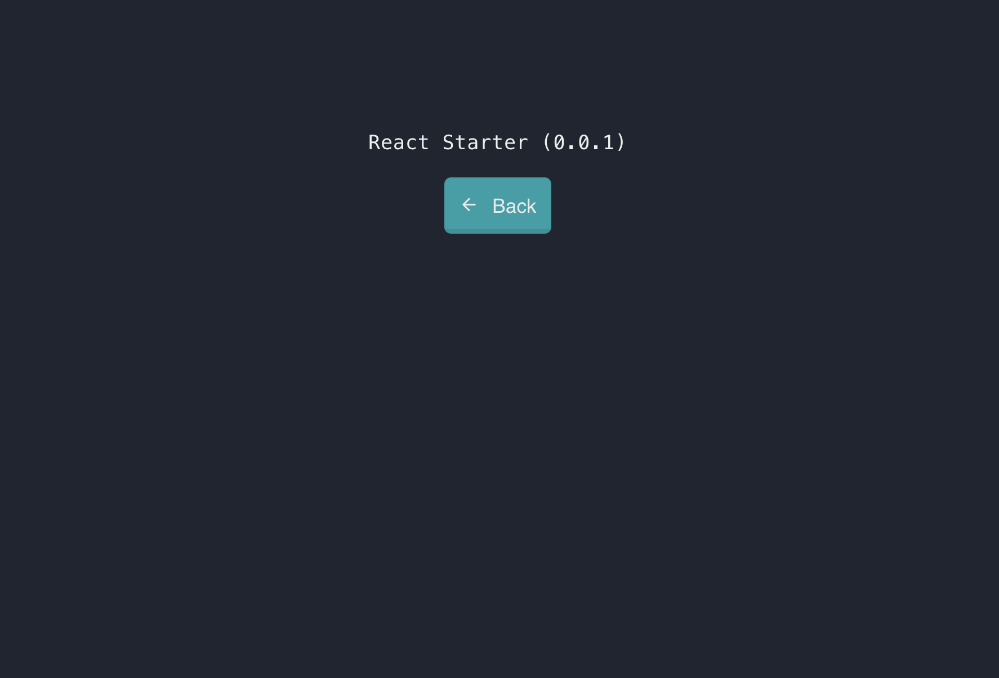

# React Starter
A Reactjs starter written in ES with [Vite](https://vitejs.dev/) based build

## Features
- SPA
- Basic components
  - Portal component
  - Appbar (App bar top or left with global actions and route specific actions)
  - Notifications (toast, info, warn, success)
  - Overlay
  - Progress
- Form component.
  - Out of the box default styling
  - Validation support (basic validators included)
  - Integrate custom components
  - MultiValInput (Supports form)
  - MultiSelect (Supports form)
  - FileUpload component (Supports form)
- [Routing](https://github.com/naikus/simple-router) (Hash based routing with custom views per route)
- Light and dark theme support
- Custom branding (Logo, colors, etc)
- [Feather](https://feathericons.com/) font icons

## Screenshots
Landing View

About View

## Todo
# Form Component Issues and Improvements

1. **Validation Timing**: The `onChange` event only fires when the form is not pristine, potentially missing initial validation errors.

2. **Field Removal**: When removing a field, the form's `valid` state isn't recalculated.

3. **Async Validation**: No support for asynchronous validation (e.g., server-side checks).

4. **Deep Object Handling**: Lack of built-in support for deeply nested object structures in form data.

5. **Array Field Handling**: No specific support for array fields (e.g., dynamic list of inputs).

6. **Performance for Large Forms**: The `useEffect` hook for form changes runs on every update, potentially causing performance issues in large forms.

7. **Reset Functionality**: Lack of a built-in way to reset all fields to their initial state.

8.  **Field Focus Management**: No built-in way to manage field focus for accessibility and user experience.

9.  **Custom Field Validation Timing**: Always validates on every change, with no way to customize (e.g., validate on blur).

10. **Error Boundary**: No error boundary to catch and handle runtime errors gracefully.

## Potential Improvements

1. Implement a more flexible validation timing system.
2. Recalculate form validity when removing fields.
3. Add support for async validation.
4. Implement handling for deep object structures in form data.
5. Add support for array fields and dynamic inputs.
6. Optimize performance for large forms, possibly with debouncing or memoization.
7. Implement a form reset function.
8. Add field focus management utilities.
9. Allow customization of validation timing (e.g., on change, on blur, on submit).
10. Implement an error boundary for the form component.